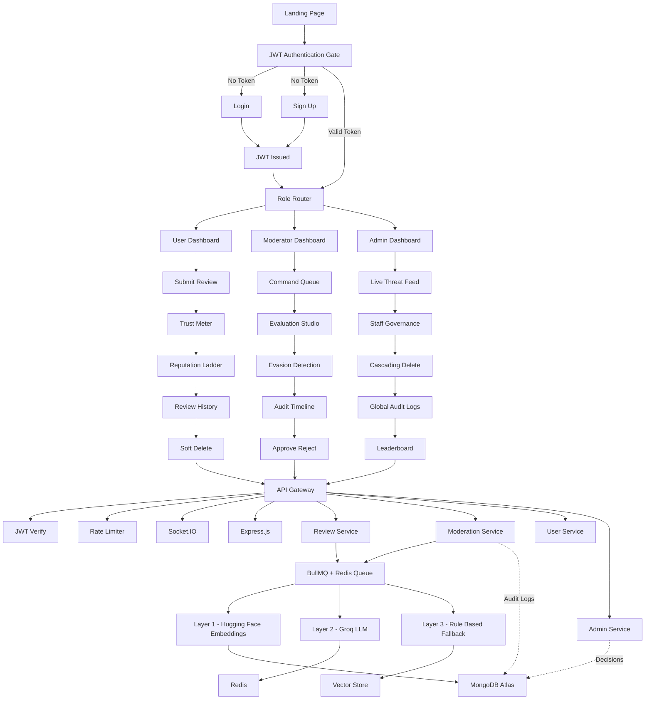

# 🛡️ ReviewGuard - AI-Powered Review Moderation Ecosystem

<div align="center">

### 🚀 AI-Native Moderation • Real-Time Threat Intelligence • Semantic Duplicate Detection


---

### 🌐 Live Demo
🚀 https://review-guard-8dcn.onrender.com/

</div>

---

# 📖 Overview

**ReviewGuard** is a production-grade AI-powered moderation platform engineered to simulate how modern digital ecosystems protect communities from:
- Toxicity
- Spam
- Duplicate reviews
- Coordinated abuse
- Manipulative content
- Repeat offenders

The system combines:
- 🧠 Large Language Models (LLMs)
- 🔍 Semantic similarity embeddings
- ⚡ Real-time WebSocket synchronization
- 🛡️ Deterministic fallback moderation
- 📡 Live telemetry architecture
- 🔐 Enterprise-grade security systems

Unlike traditional moderation dashboards, ReviewGuard operates as a complete **Trust Infrastructure System** with role-isolated operational layers for:
- Users
- Moderators
- Administrators

---

# ✨ Core Highlights

## 🧠 AI-Native Moderation Pipeline
- LLM-based contextual toxicity auditing
- Semantic duplicate detection
- Explainable AI reasoning
- Multi-layer moderation defense
- Fail-soft moderation fallback

---

## ⚡ Real-Time Event Infrastructure
- Instant moderation updates
- Live dashboard synchronization
- WebSocket-driven status propagation
- Real-time threat feeds
- Moderator queue streaming

---

## 🔐 Enterprise Security Layer
- JWT Authentication
- Role-Based Access Control (RBAC)
- Tiered Rate Limiting
- bcrypt password hashing
- Audit logging system
- Protected route middleware

---

## 📊 Analytics & Governance
- Moderator analytics dashboards
- Threat distribution insights
- Audit trail system
- Staff governance controls
- Performance leaderboards

---
## 🏗️ Full System Architecture



# 🚀 Technology Stack

| Layer | Technologies |
|---|---|
| Frontend | React 18, Vite, Tailwind CSS |
| Backend | Node.js, Express.js |
| Database | MongoDB Atlas + Mongoose |
| Authentication | JWT + bcrypt |
| Real-Time | Socket.io |
| AI Infrastructure | Groq (Llama-3), HuggingFace |
| Embeddings | BGE-Small-En |
| Queue System | BullMQ |
| Broker | Redis |
| Charts | Recharts |
| Validation | express-validator |
| Security | express-rate-limit |
| Deployment | Render |

---

# 🧠 AI Intelligence Infrastructure

## 🔍 Layer 1 - Semantic Duplicate Detection

### Purpose
Detect semantically similar reviews even when wording changes.

### Technologies
- TF-IDF Vectorization
- Semantic Embeddings
- Cosine Similarity

### Capabilities
✅ Duplicate review detection  
✅ Semantic spam analysis  
✅ Coordinated review manipulation detection  
✅ Paraphrased duplicate identification  

### Threshold

```txt
Similarity ≥ 0.85 → Duplicate Review
```

---

# 🤖 Layer 2 - Neural Toxicity Detection

### Powered By
- Groq API
- Llama-3-8B

### Detection Categories

| Category | Severity |
|---|---|
| Profanity | 0.35 |
| Hate Speech | 0.65 |
| Threats | 0.90 |
| Spam | 0.45 |
| Personal Attacks | 0.55 |

---

## Advanced Signals
- Excessive CAPS
- Aggressive punctuation
- Contextual hostility
- Threat probability scoring
- Manipulative language patterns

---

## Explainable AI (XAI)

Each moderation decision includes:
- AI-generated reasoning
- Confidence scoring
- Toxicity evidence
- Duplicate evidence

---

# 🛡️ Layer 3 - Deterministic Shield

## Purpose
Fallback moderation during:
- AI outages
- API failures
- Network instability
- Queue congestion

## Mechanism
- Regex heuristics
- TF-IDF similarity
- Rule-based scoring

## Advantages
✅ Zero external dependency  
✅ Ultra-fast execution  
✅ Fail-soft protection  
✅ Guaranteed moderation continuity  

---

# ⚡ Real-Time Moderation Pipeline

```txt
User Submits Review
          ↓
Parallel AI Analysis
          ↓
Duplicate Detection
          ↓
LLM Toxicity Audit
          ↓
Fallback Shield Validation
          ↓
Threat Classification
          ↓
Moderator Queue
          ↓
Socket.io Event Emission
          ↓
Instant Dashboard Update
```

---

# 👤 User Role - Content Contributor

## Features

### 🧠 AI Pre-Check Warnings
Users receive:
- Toxicity alerts
- Duplicate warnings
- Submission recommendations
- AI-generated moderation hints

---

## 📈 Trust & Impact Meter

### Reputation Tiers
- Probationary
- Trusted Reviewer
- Verified Contributor
- Elite Guardian

### Formula

```txt
(Approved Reviews / Total Reviews) × 100
```

### Visual System
- Animated SVG circular progress bars
- Dynamic stroke animations
- Live trust recalculations

---

## 📜 Symmetric Review History

### Features
- Vertically locked lifecycle feed
- Real-time review state updates
- Status accent visualization
- Responsive mirrored layout system

---

## 🗑️ Soft Delete Integrity Layer

Users may remove reviews publicly.

However:
- Reviews remain internally archived
- Moderators can detect evasion attempts
- Prevents delete-and-retry abuse

---

# 🛡️ Moderator Role - System Evaluator

---

## ⚡ Command Queue
- Prioritized flagged review stream
- AI severity indicators
- Duplicate confidence metrics
- Real-time synchronization

---

## 🔬 Evaluation Studio
- Side-by-side duplicate comparison
- AI-generated reasoning panels
- Semantic similarity analysis
- Moderation evidence visualization

---

## 🕵️ Evasion Detection
Moderators can inspect:
- Deleted reviews
- Repeat abuse patterns
- Bot-like review behavior
- Coordinated spam clusters

---

## 🧾 Audit Timeline
Every review includes:
- Submission timestamps
- AI scan completion time
- Moderator action logs
- Status transitions

---

# 👑 Admin Role - Strategic Overseer

---

## 📡 Live AI Threat Feed
Terminal-style telemetry stream displaying:
- Incoming reviews
- Threat classifications
- Moderator actions
- Queue activity
- System alerts

---

## 🏛️ Staff Governance Hub

### Admin Capabilities
✅ Promote/Demote users  
✅ Toggle account access  
✅ Deactivate moderators  
✅ Cascading account deletion  
✅ Governance-level control  

---

## 📚 Global Audit Logs
Complete moderation traceability including:
- Approval/Rejection logs
- Moderator identity
- Precision timestamps
- Accountability tracking

---

## 🏆 Staff Performance Leaderboard
Tracks:
- Review throughput
- Moderation efficiency
- Approval accuracy
- Response latency

---

# ⚙️ Asynchronous AI Infrastructure

## BullMQ + Redis Queue System

### Workflow

```txt
Producer (Submission)
         ↓
Redis Queue
         ↓
BullMQ Worker
         ↓
AI Processing
         ↓
Database Persistence
         ↓
Socket.io Push
```

---

## Benefits

✅ Non-blocking APIs  
✅ Horizontal scalability  
✅ Retry resilience  
✅ Queue persistence  
✅ Low-latency user experience  

---

# 🔐 Security Infrastructure

| Security Layer | Implementation |
|---|---|
| JWT Authentication | 7-Day Expiry |
| Password Hashing | bcrypt |
| RBAC | Route-level middleware |
| Validation | express-validator |
| Rate Limiting | Multi-tier protection |
| CORS Protection | Restricted origins |
| Audit Logging | Immutable tracking |

---

# 🚨 Tiered Rate Limiting

| Endpoint | Limit |
|---|---|
| General API | 10k / 15m |
| Review Submission | 1k / hour |
| Authentication | 500 / 15m |

---

# 📁 ReviewGuard Project Structure

```
Review Guard/
├── backend/
│   ├── config/
│   │   └── db.js              # MongoDB Atlas connection
│   │
│   ├── controllers/           # Business logic
│   │   ├── authController.js
│   │   ├── reviewController.js
│   │   ├── moderationController.js
│   │   └── adminController.js
│   │
│   ├── middleware/
│   │   ├── auth.js            # JWT verification
│   │   ├── roleCheck.js       # Role-based access
│   │   └── rateLimiter.js     # Rate limiting
│   │
│   ├── models/
│   │   ├── User.js
│   │   ├── Review.js
│   │   └── AuditLog.js
│   │
│   ├── routes/
│   │   ├── auth.js
│   │   ├── reviews.js
│   │   ├── moderation.js
│   │   └── admin.js
│   │
│   ├── scripts/
│   │   └── seed.js            # Database seeder
│   │
│   ├── utils/
│   │   ├── toxicity.js        # Mock AI toxicity detector
│   │   └── tfidf.js           # TF-IDF duplicate detection
│   │
│   ├── .env                   # Environment variables
│   └── server.js
│
└── frontend/
    └── src/
        ├── api/
        │   └── axios.js
        │
        ├── components/
        │   ├── Navbar.jsx
        │   ├── StatusBadge.jsx
        │   ├── ProtectedRoute.jsx
        │   └── LoadingSpinner.jsx
        │
        ├── context/
        │   └── AuthContext.jsx
        │
        └── pages/
            ├── Login.jsx
            ├── Register.jsx
            ├── UserDashboard.jsx
            ├── ModeratorPanel.jsx
            ├── Analytics.jsx
            └── AdminPanel.jsx
```

---

# 📡 API Endpoints

## Authentication

```txt
POST   /api/auth/register
POST   /api/auth/login
GET    /api/auth/me
```

---

## Reviews

```txt
POST   /api/reviews
GET    /api/reviews/my
DELETE /api/reviews/:id
```

---

## Moderation

```txt
GET    /api/moderation/reviews
PUT    /api/moderation/reviews/:id/approve
PUT    /api/moderation/reviews/:id/reject
GET    /api/moderation/analytics
GET    /api/moderation/audit-logs
```

---

## Admin

```txt
GET    /api/admin/users
PUT    /api/admin/users/:id/role
PUT    /api/admin/users/:id/toggle-status
DELETE /api/admin/users/:id
```

---

# 🧪 Test Credentials

| Role | Email | Password |
|---|---|---|
| 👑 Admin | admin@reviewmod.com | Admin@123 |
| 🛡️ Moderator | moderator@reviewmod.com | Mod@1234 |
| 👤 User | user@reviewmod.com | User@1234 |
| 👤 User | alice@reviewmod.com | Alice@1234 |

---

# ⚙️ Local Setup

## Clone Repository

```bash
git clone <your-repository-url>
cd ReviewGuard
```

---

## Backend Setup

```bash
cd backend
npm install
```

Create `.env`

```env
MONGO_URI=your_mongodb_uri
JWT_SECRET=your_secret_key
PORT=5000
CLIENT_URL=http://localhost:5173
```

---

## Frontend Setup

```bash
cd frontend
npm install
```

---

## Seed Database

```bash
cd backend
npm run seed
```

---

## Start Development Servers

### Backend

```bash
npm run dev
```

### Frontend

```bash
npm run dev
```

---

# 🎯 Key Engineering Concepts Demonstrated

- Full-Stack MERN Development
- AI-Powered Moderation Systems
- Semantic Similarity Analysis
- WebSocket Event Architecture
- Real-Time Synchronization
- Distributed Queue Systems
- Explainable AI
- Role-Based Authorization
- Scalable Backend Infrastructure
- Threat Intelligence Design
---

# 👩‍💻 Author

## Keerthishree Kesavan 🌷
AI/ML • Full-Stack Development • Explainable AI • Real-Time Systems

---

# ⭐ Support

If you like this project, give it a ⭐ on GitHub and feel free to fork or contribute.
